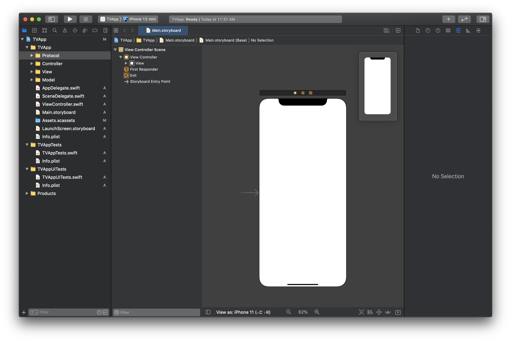

# swift-w4-tv
모바일 4주차 TV 저장소

### Initial Setting

- create .gitignore
- create Project
- create groups : Model, View, Controller, Protocol

### Download Data

- download Json data

### Create Model

- create protocol : TVCell
- create model : TVOriginalCell, TVLiveCell

### Create new Controller

- TVCollectionViewController
- extension : adopt UICollectionViewDataSource, UICollectionViewDelegate, UICollectionViewDelegateFlowLayout

### CellModel 수정, CellData 추가

- 파싱하여 저장하기 위한 모델 구조체 수정

  - Channel, Clip, Live, TVOriginal, TVLive

- 파싱하여 모델을 가지고 있는 클래스 생성

  OriginalData, LiveData

### CellModel 수정2

- 모델을 셀에서 사용하기 위해 getter 메소드 구현
- 셀의 크기를 지정한 후 서브뷰둘의 오토레이아웃 지정...ing

### CellDataModel 수정

- generic 활용하여 initializetData 메소드를 하나로 구현
- OriginalData, LiveData에 CollectionViewDataSource에서 데이터를 제공하기 위해 count, getData 구현

