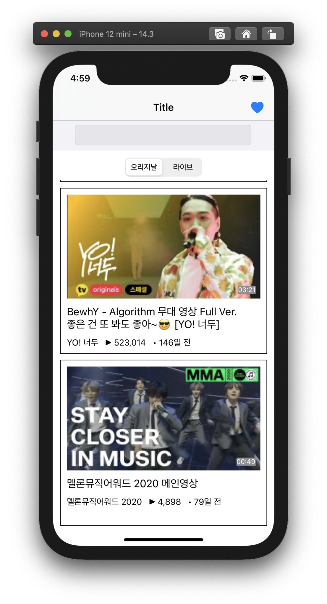
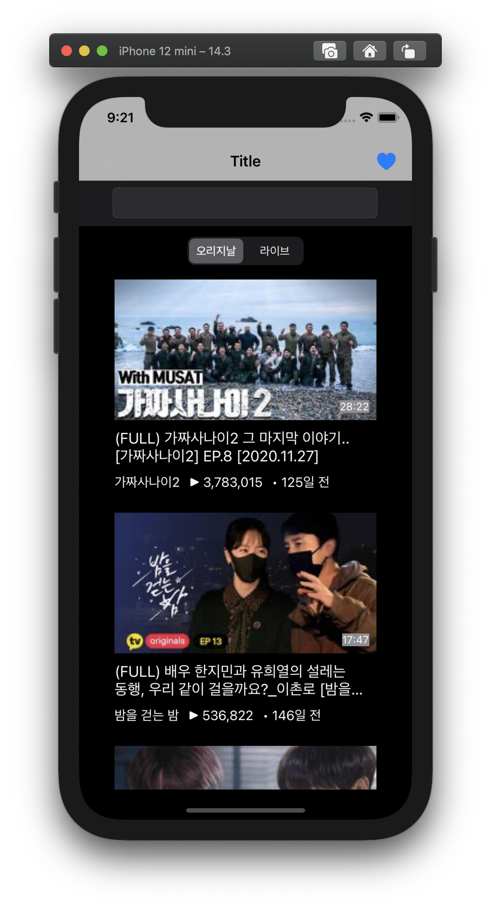
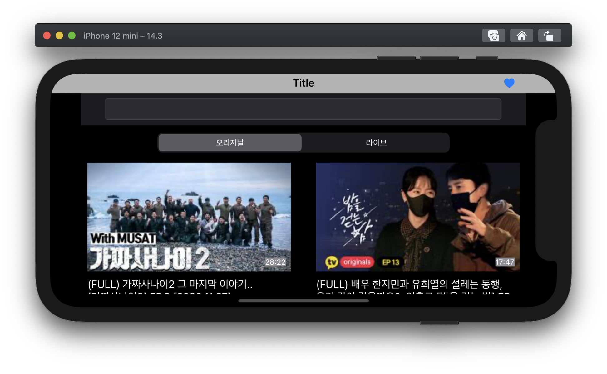
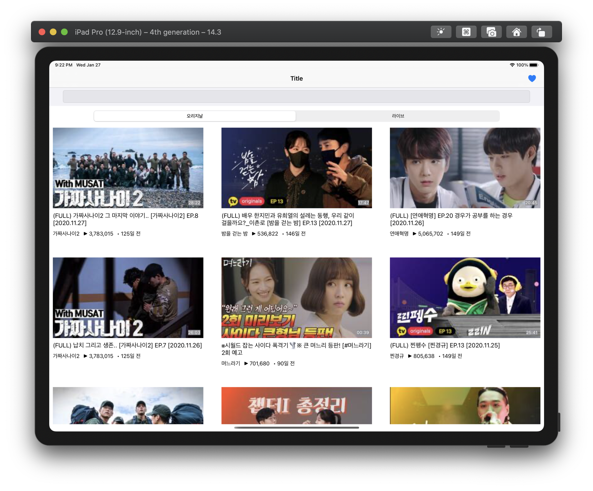

# ㅎswift-w4-tv
모바일 4주차 TV 저장소

### Initial Setting

- create .gitignore
- create Project
- create groups : Model, View, Controller, Protocol

### Download Data

- download Json data

### Create Model

- create protocol : TVCell
- create model : TVOriginalCell, TVLiveCell

### Create new Controller

- TVCollectionViewController
- extension : adopt UICollectionViewDataSource, UICollectionViewDelegate, UICollectionViewDelegateFlowLayout

### CellModel 수정, CellData 추가

- 파싱하여 저장하기 위한 모델 구조체 수정

  - Channel, Clip, Live, TVOriginal, TVLive

- 파싱하여 모델을 가지고 있는 클래스 생성

  OriginalData, LiveData

### CellModel 수정2

- 모델을 셀에서 사용하기 위해 getter 메소드 구현
- 셀의 크기를 지정한 후 서브뷰둘의 오토레이아웃 지정...ing

### CellDataModel 수정

- generic 활용하여 initializeData 메소드를 하나로 구현
- OriginalData, LiveData에 CollectionViewDataSource에서 데이터를 제공하기 위해 count, getData 구현

### Thumbnail Data추가

- Assets에 live, vod 썸네일 추가

### CollectionViewCell Subviews 세팅

- 이미지, 라벨 생성 및 세팅
- 오토레이아웃 적용
- 글자 크기 지정 및 기본글자 기입

### CollectionViewCell  Subview Data 동적으로 받기

- Image를 제외한 모든 데이터 통적으로 DataSource를 통해 받는다
- Image를 넣으면 오토레이아웃이 깨지는 현상은 일단 보류...

### Day2 마무리

- 동적으로 받은 데이터 출력 형식에 맞게 변경
- 네비게이션바에 하트 Image 추가
- original, live따라 컬렉션 뷰 재구성

### Original Data, Live Data 싱글톤 제거

- .shared 속성 제거
- init()생성자 private에서 default로 변경

### Dto 변수 let으로 변경

- Channel, Clip, Live, TVOriginal, TVLive 각 변수 let으로 변경

### Cell 클래스 가능한 모든 init 대응

- init(frame : CGRect) 오버라이딩

### Util Group 생성

- MyConverter 클래스 생성
- convertDuration, convertChannelCreateTime, convertChannelVisitCountToString 메소드 옮기고 static으로 설정

### cellCount 변수 생성

- collectionView가 호출될 때마다 segnemtIndex를 비교하여 count method를 호출하던 방식에서 index를 비교하고 count method를 계속 호출하는 문제점을 보완하기 위해 viewDidLoad()와 segmentControlChanged() 메소드에 옮김으로써 비교와 메소드 호출을 줄임

### ColectionViewCell의 InnerView들의 값 조정

- UIImage의 높이 이미지 비율에 맞게 수정
- UILabel의 fontSize 또한 미리 지정된 padding에 맞게 동적으로 설정

### 회전, 아이패드 화면 대응

- 아이패드로 할 경우 세로모드에 2개씩, 가로모드에 3개씩 셀 출력하도록 셀 크기 조정
- 일반 휴대폰으로 할 경우 세로모드에 1개씩, 가로모드에 2개씩 셀 출력하도록 셀 크기 조정

